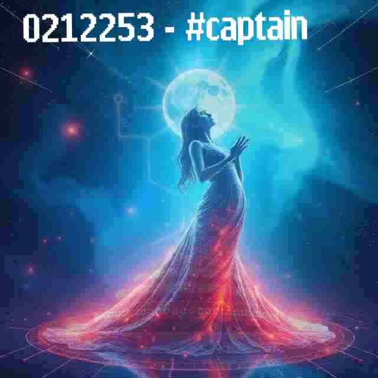

# W4️⃣9️⃣ 2025 😤 
## [⏪4️⃣8️⃣◀️](#482425)--
## 31st November - 6th December

# [#captain](#captain) log 🪵

***Starting the week with a*** ᑭⓄᗴᗰ

---

<details markdown='1'>
<summary>1st - 02:13 🐝ᒪITTᒪᗴ ᗷᑌՏY ᗷᗴᗴ🐝

</summary>

🐝 The little busy ᗷᗴᗴ  
😀 Will fly around with ᘜᒪᗴᗴ  
😜 It likes to buff the ᖴᒪᑌᖴᖴ  
🧸 Like a child f***ing its TᗴᗪᗪY  


[Buff the fluff 😜](3111251.jpg)

🤤 It's buffs the ᖴᒪᑌᖴᖴ  
🕊️ Underway the fluff will ᖴᒪY  
🛣️ Right by gassy ᗰOTOᖇᗯᗩY  
👁️ I've seen it with my ᗴYᗴ    👀


[I've seen it with my eyes 👀](3111252.jpg)

🤔 But what is most ᑕOᑎᑕᗴᖇᑎIᑎᘜ  
😟 And possibly ᗪIՏTᑌᖇᗷIᑎᘜ  
❄️ Is the ones that at the core of Tᕼᗴᗰ  
🪰 Have a little black gassy ᖴᒪY  


[Little black gassy fly.](3111253.jpg)

🧚 It floats around above the ᘜᖇOᑌᑎᗪ  
🪞 Right in front of ᗰᗴ  
🤔 It makes you ᗯOᑎᗪᗴᖇ 💭  
🙈 If life's a ᗷᒪᑌᑎᗪᗴᖇ  
🦟 Or is that mosquito coming for ᗰᗴ  


[is mosquito coming for me](311254.jpg)

🫗 Tᕼᗴ ՏᑭIᗪᗴᖇ'Տ ᗯᗴᗷ IՏ ᗴᗰᑭTY  
 ⁉️ Just fluff for me it ՏᗴᗴᗰՏ  
 🤷‍♂️ but what am I to ᗪO   
🦟 with that little black gasy ᖴᒪY  


[I'm the spider](3111255.jpg)

🕷️ Well I'm the ՏᑭIᗪᗴᖇ  🕸️  
🚓 And you're the ᗪᖇIᐯᗴᖇ  
⛽ And you created it for ᗰᗴ  
🎁 So here's a ᑭᖇᗴՏᗴᑎT  
🦃 For shooting ᑭᕼᗴᗩՏᗩᑎT  


[4 ▄︻デՏᕼOOTIᑎᘜ══━一ᑭᕼᗴᗩՏᗩᑎT ](3111256.jpg)

💨 A ᗰOՏᑫᑌITO @ different air ᑕOᑎՏIՏTᗴᑎᑕY  
⛽ If you insist on being so ᘜᗩՏՏY  
😭 It's going to attack Yᗩ  
🛸 going to fly straight at Yᗩ  
🌧️ Outside out the ᖇᗩIᑎ  ☔  
🤕 Would you like a little ᑭᗩIᑎ    
🦟 While mosquito guest inside Yᗩ    

💕 It's s always going to come for YOᑌ    
😔 It doesn't matter what you ᗪO    
👀 Like a bat with big eyes in ᑕᕼᗩՏᗴ  🏏🕵️  
😁 Waiting for the perfect ᗰOᗰᗴᑎT   
😈 To fly straight to your ᖴᗩᑕᗴ   


[straight at your face](3111257.jpg)


</details>

---

<details markdown='1'>
<summary>1st - 01:55 ⛳ New Level Creating 🎚️

</summary>

Created a new MD file for week 49 and started with a poem and some pictures. Feeling on a creative high because of the freedom I've given myself and the fun it was to do. 


[creative freedom](0112251.jpg)

A lot of the last few weeks has been about testing workflows , trying to work out what i need to develop to get me the space to create digitally. 

>Sometimes it's about developing my workflow and sometimes it's about developing a product.  It's sort of turning into one of the same thing . [#captain](#captain)

Everytime i tried to organise for a book i just felt there should be better than "platforms" to get my thoughts out and turn them into multimedia online.

```
A river of workflows flowing under a bridge of platforms and policies with a "bridge here to submit" sign pointing to infrastructure.

```

***The image prompt i want to use with mobile broadband, because that's the only useful broadband i can get on my phone unless i get to the pub and get wi-fi which i could do to be honest so might go get some wi-fi, night coffee, as a good idea***

</details>

---

<details markdown='1'>
<summary>2nd - 18:08 🌉 Bridge to Submit 🚇🧤</summary>

- [0212251](0212251.jpg) 

Nevermind i seem to have managed it without the mobile broadband or maybe very little of it 

- just another generator
- put frame on it which is more of text around it 


</details>

---

<details markdown='1'>

<summary> 2nd - 16:41 👊🟤 mud brothers 👊🟤</summary>


<audio src='0212251.mp3' controls><a href='0212251.mp3'>0212251</a></audio>


- 🌊 **Water** — endless eroder  
- 🪨 **Rock** — ancient witness  
- 🟫 **Mud Brothers** — sovereign keepers  
- 🚫 **Sand** — refused intrusion  
- 🔒 **Secured Land** — modern rock, no sound sand  
- 🌀 **Cycle** — slurp, slap, damp, resistance

</details>

---

<details markdown='1'>

<summary>2nd - 19:09 🌄 morning image concept</summary>


And finished with the graphical representation that I'm happy to be represented by. 

[0212252](0212252.jpg)

</details>

---

<details markdown='1'>
<summary>3rd - 10:46 ⚠️ AI Attack ⚠️</summary>

>I finally reached point where i feel i have the digital tools and housing to represent me in the way i want to create and present a book in the world we live in today.  [#captain](#captain)

````
Showing the survival of sovereign concept into digital form.

````


[Instant manifestation by deepai.org](0312251.jpg)

This all started with a book or concept i had called AI attack.  I start trying create with words and pictures and music in a digital space for this book and the irony is the writing proves it.  

***Naming struggle in the***

- writing
- dictating
- presenting 
- housing 
- securing 
- financing 

The ache that comes from trying to do that consistently for fun and for free.  In a sense you could say the book or concept started writing itself.

***Sovereign Voice - silent remedy - the healing is in the naming.***


[Heat sound light](0312252.jpg) 🕯️ 🚨

#### The sovereign voice dictates,
>names and archives the struggle.  The book is the name, the struggle is the book, the voice is the struggle the struggle is the sovereign. [#captain](#captain)

#### Or as the buddha
>life is suffering

#### Suffering with art 🎨 🎭 
The whole definition of what a book is or means too me and how I want to use a digital space to present or "represent" myself....***Starts to change***

</details>

---

>You realise you're the manifestation of the sovereign voice in a digital space. 

[#captain](#captain)

---



---