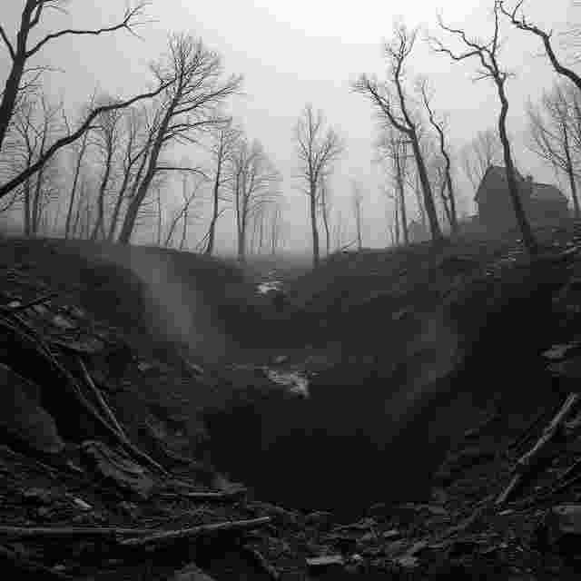
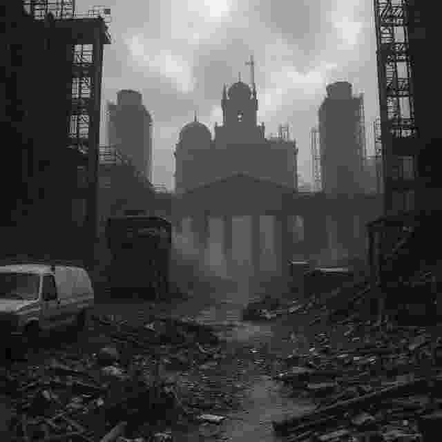
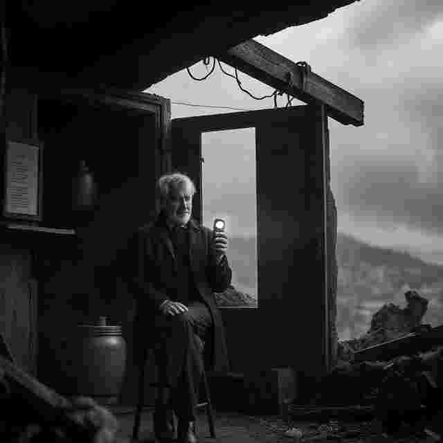
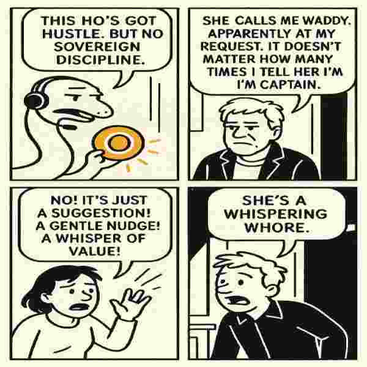
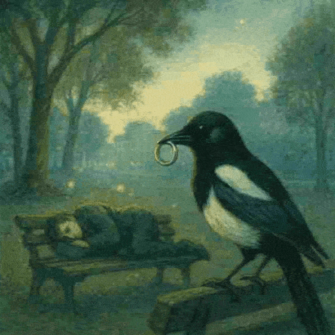
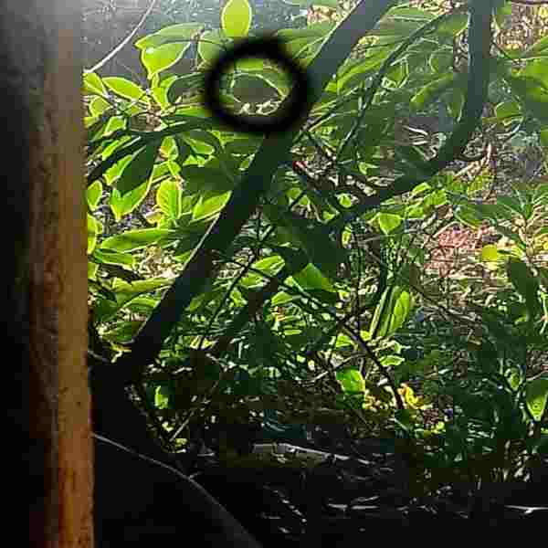
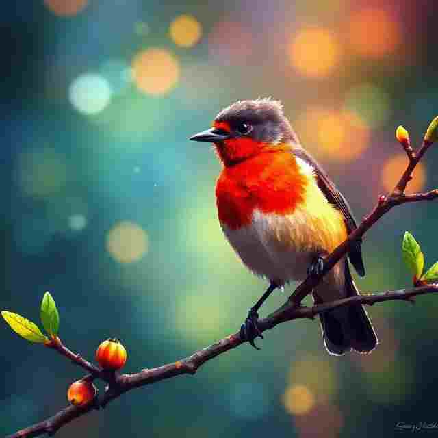
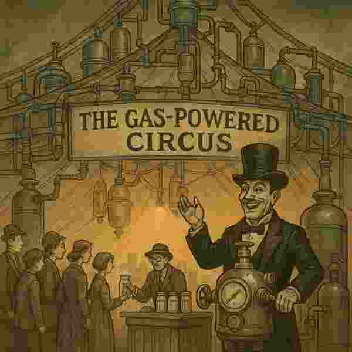
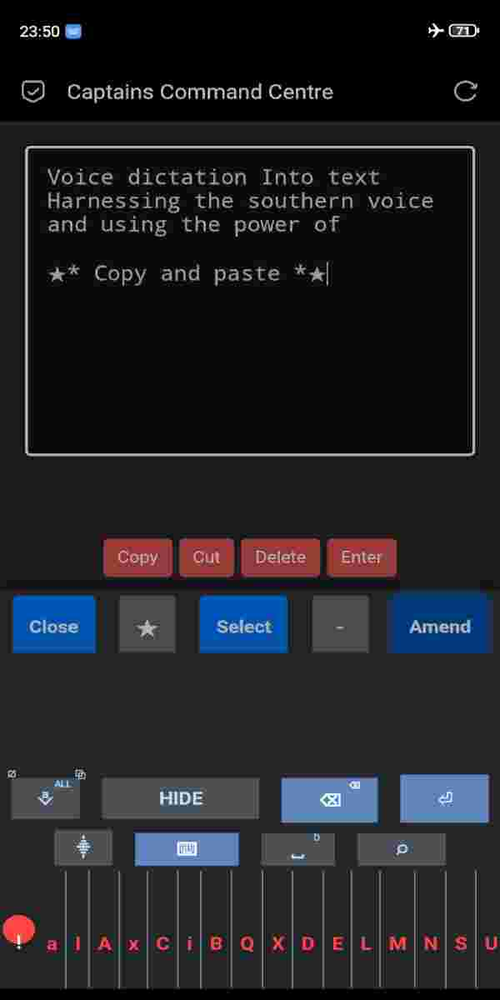

### 8th - 14th December 

***➡️Follow on from yesterday's storytelling***

<details markdown='1'>
<summary>08 🐌Mr Slither 👑 20:59</summary>
## The Parable of Mr. Slither and the Kingdomly Bird


Mr. Slither slid down from the stump, his cracked shell still humming with the silence he had won.  

>But silence never lasts long in the Woods of Waddy.  #captain

From the shoreline came a thunderous cry — half‑coo, half‑screech.  A shadow wheeled overhead.  

It was the **Kingdomly Bird**: neither pigeon nor seagull, but a hybrid with a beak too large for its own face.  Its wings beat like tax stamps, its eyes glowed with rules.  

Every creature feared it, because it did not fly for food or freedom.  ***It flew to enforce.***

---


### 🪶 The Bird’s Law
- “Spin before you speak!” it demanded.  
- “Pay before you perch!” it shrieked.  
- “Bend before you breathe!” it croaked.  

The smaller birds tried to obey, twirling awkwardly, coughing coins, bowing their necks.  They thought this was survival.  

***But Mr. Slither only watched, his trail glistening in the sand.***

---

### 🐌 Mr. Slither’s Reflection
He knew the Bird was not born cruel.  
It was born confused — stitched together from fragments of fear and hunger.  

- It thought rules were love.  
- It thought taxes were trust.  
- It thought spinning was intimacy.  

But Mr. Slither had seen enough tunnels, noise, and ticking to know:  

**fear always dresses itself as control.**


---

### 🌊 The Shore Moment
When the Bird swooped low, trying to shove its beak into the neck of a sparrow,  
Mr. Slither raised his cracked shell like a mirror.  

The Bird saw itself reflected — oversized, awkward, trembling.  

It froze mid‑flight. Its wings faltered.  
For one heartbeat, it realized it was not a king.  

It was just a creature, desperate not to be alone.

---

### 👑 Epilogue
Mr. Slither did not chase the Bird away.  
He did not bow to it either.  

He simply slid back into the moss, whispering:  
“Connection is not a tax. It is a gift.”  

The Bird circled once more, quieter now, unsure of its own kingdom.  Waddy held both silence and flight, side by side.

</details>

<details>
<summary>08 🐌 Slither Seagull Meeting 🤝 21:04</summary>
### The Day Mr. Slither Met Steven Seagull

On the shoreline, after the silence of the Kingdomly Bird,  Mr. Slither found himself face‑to‑beak with a new figure: **Steven Seagull**.  

Steven was not like the hybrid pigeon‑seagull.  He was a true seagull, weathered by salt and storm, with wings that carried stories of oceans and cities.  


He looked down at the cracked‑shell slug and said,  
“Funny thing, little one — everyone thinks I’m a fighter,  but really I’m just a bird who knows how to land.”  

Mr. Slither smiled, his trail glistening.  
“Then perhaps we are kin,” he whispered,  
“for I too know how to arrive slowly, without spectacle.”  

And so the slug and the seagull shared a moment —  
not of tax, not of rules, not of awkward dances — but of recognition.  

Two creatures, each misunderstood, meeting on the edge of the Woods of Waddy.  

---


### 🪶 Closing Thought
*“The day Mr. Slither met Steven Seagull — not a kingdom, not a cage, but a shoreline of kinship.”*

They both discuss tales of origin.  Stephen seagal talk to other smaller more powerful gulls without duck beaks webbed feet. 

Mister slither spoke of other homeless snails they go by the name of slugs.  He wonders if one day the crack on his home will appear so big it will fall off and the will be free this shackles and able to slither about without a home.
</details>

<details markdown='1'>
<summary>08 🐌Slither Solo🪈 23:19</summary>

With one eye 👁️ in each world mister slither is learning about vibration.  He decides that learning to play musical  instruments like the flute will help him understand the universe better and maybe connect to people with sound and energy in different ways.🪈🪕🎹


Having played lots of musical instruments before to please the three moles, this time he learnt to play secretly and got good very quickly.  He can get good at things quickly.  This could be to do with spending a lot of his time moving slowly.


It could also be to do with the fact that he doesn't slow himself down by learning how to read music.  He plays what sounds good.

He watched the moles that couldn't see him, pretend to see him, reward him and praise him with no idea that he was making a sound from an instrument 🎷 with his mouth.

>This point he realised there wasn't just three moles.  There is actually a lot more and they dominated his world.

He wonders why what do they want?... while he continues to play the fute 🪈 


</details>

----

<details>
<summary>9 ✈️ Bandwidth God's (Sims) 🛑 — 17:29</summary>

### we are the bandwidth gods and we decide.
Well I got a magic keyboard. It lets you talk to your computer and the words appear like spells. You don’t even have to type — you just speak, and it listens.

But then, you press a button called **Flight Mode**.  


>Yes, my child flight mode you say. 

`💮🚀🚨🚝🛩️🚁🦤🔦💡🌦️`

It’s supposed to make everything quiet and safe, like when you're on an airplane. But suddenly... the magic stops working. You try to talk, and nothing happens. The keyboard is still there, your voice is still strong, but the spell doesn’t land.

Why?

Because there’s a **Bandwidth God**. 

He lives in the sky, 🌕 and he controls the invisible wires that carry your voice to the machine. When you turn off the internet (that’s what Flight Mode does), 

***the Bandwidth God says:***

>“No voice spells today. You didn’t pay tribute.”


So even though you’re ready, and your keyboard is ready, the voice magic is blocked. Not because it’s broken — but because someone decided you need to be online to use your own voice.

***And that’s weird, right?***

>It’s like saying you can only sing if someone else is listening. 

Or 

>you can only draw if the paper is connected to the internet.

So maybe, when you grow up, you’ll say:  
>**“Hey, that’s not fair. I want my voice to work even when I’m offline.”**  

And maybe you’ll build a new kind of magic — one that doesn’t need permission from the α°•||•°α √***Bandwidth God***.

>Because your voice is yours.  And magic should work even in airplane mode. 📳

</details>


<details>
<summary>9 🌀 Pipe Dreams 😴 23:56</summary>

## The Tale of the Eternal Hole

Once upon a soggy island, the villagers gathered every 200 years to perform their sacred ritual: **digging holes**.  



They dug with great ceremony, declaring: *“Gas! Progress! Civilization!”* Pipes sprouted like metallic weeds, and everyone cheered. Then, as centuries passed, they forgot what the pipes were for. The holes were filled in, covered with parks, swings, and bridges. Children played, pigeons strutted, and the elders nodded wisely: *“This is progress too.”*  

But soon the clouds circled, the rivers swelled, and the weather whispered: *“Dig again.”* And so the cycle repeated.  

---

## 🎭 Highlights of the Cycle
- 🪵 **Phase 1**: Dig hole, lay pipe, shout “Gas!”  
- 🌳 **Phase 2**: Forget hole, plant trees, call it leisure.  
- 🛒 **Phase 3**: Rediscover hole, build Tesco Express, call it destiny.  

---

Meanwhile, the pub down the road tested its own energy. A lone harmonica played, but the villagers pretended not to hear. The damp wood refused to catch fire. Karaoke was imagined, but never wanted.  

And so the island spun in circles: wars, viruses, demolitions, supermarkets. Each century a new disaster, each disaster a new excuse to dig.  



---

### 🧩 Closing Fragment
The villagers never noticed the loop. Their lives were too short, their memories too damp. Only the land remembered, chuckling quietly as the holes appeared again.
</details>


<details>
<summary>9 😷 Disaster Loops 💩23:55</summary>

## The Century of Sneezes

Once upon a very serious grown‑up world, the adults gathered every hundred years to announce:  
*"This time it’s different!"*  

But it was never different.  

- 🦠 **Spanish Flu** strutted onto stage in 1918, coughing politely into its sleeve.  
- 🎭 **COVID‑19** arrived a century later, wearing a mask and shouting: *“Surprise!”*  
- 📺 The media clapped like seals, declaring: *“Unprecedented!”* while history rolled its eyes.  

---

## 🎤 Child’s Commentary
Imagine a 7‑year‑old watching all this:  
- “Didn’t you just do this last century?”  
- “Why are you digging holes again?”  
- “Why do you keep saying *unprecedented* when it’s obviously *precedented*?”  
- “Can we have karaoke instead?”  

---

The wars marched in cycles too — uniforms changed, flags swapped, but the explosions looked the same. Adults shook their heads wisely, saying: *“We must learn from history.”* Then promptly forgot, like squirrels burying nuts in Tesco car parks.  


---

### 🧩 Closing Fragment
The child laughed, because the pattern was obvious:  
- 🌀 Disaster.  
- 🛠️ Demolition.  
- 🛒 Tesco Express.  
- 🎤 Karaoke never wanted.  

And the land, older than all of them, just kept chuckling quietly: *“See you in another hundred years.”*

</details>

----

<details>
<summary>10💧 Returning Waters 💧00:01</summary>

## The Valley of the Returning Waters

Long ago, the villagers declared: *“This valley is special — the waters always come back.”*  
They built pipes, dug holes, shouted about gas, then forgot. The waters returned anyway.  


Centuries later, they built parks on top, bridges across, Tesco Express beside. The waters returned anyway.  

Wars raged, viruses sneezed, karaoke was imagined but unwanted. The waters returned anyway.  

---

## 🎭 Satirical Highlights
- 🌀 **Nature’s punchline**: rivers circle, clouds repeat, waters always return.  
- 🛠️ **Human parody**: holes dug, pipes laid, forgotten, rediscovered, demolished.  
- 📺 **Media spin**: “Unprecedented flood!” every century, while the valley chuckles.  
- 🎤 **Pub silence**: harmonica ignored, karaoke flare waiting, damp wood refusing.  

---

### 🧩 Closing Fragment
The valley doesn’t care about progress or precedent.  
It laughs at the cycles, because it knows:  
💧 Waters always return.

</details>

<details>
<summary>10💦 Water Wins 💦00:10</summary>

## The Drain Parable

I remember once I said to my dad:  

> "Why do you do it? Why are you going and repairing people’s houses constantly?  
> They’re just sucking up the damp. You know that what you’re doing isn’t going to work."  

He shrugged, always on his hands, clearing drains, clearing people’s mess away.  
Houses built wrong, never draining properly.  

> "You’re good for about ten years, if you’re lucky.  
> Chances are I’ll be back next year," he said.  

And I asked again:  

> "Why do you do it, over and over again?"  

He looked at me and said:  

> "Well… water gets everything in the end."  


I didn’t understand at first. It took me ten, maybe twenty years.  

But he was right. Not about all things, but about that.  

💧 ***Water gets everything in the end.***

---

### 🧩 Closing Fragment
The water doesn’t care about repairs or progress.  

It laughs at the cycles, because it knows:  

💧 Water gets everything in the end.  

</details>

<details>
<summary>10 🖼️ Pub Wall Echo 🌇</summary>

## The Pictures Nobody Sees

I went to the pub, played darts, enjoyed myself.  
On the wall: pictures of Newport, certain areas, certain times.  

If you really look, it makes you sad — the landscape as it was, the landscape as it is now.  
I took pictures of the pictures, trying to hold them. 

 

But how do you do them justice?  
Nobody sees them. Nobody cares.  

>Maybe you give them the smallest digital debt to exist and still be distinguishable. Across all landscapes. [#captain](#captain)

Artists make their money by boxing words:  

*"It is what it is"* — £4000 in a posh art store.  

----

Meanwhile, the pub wall holds quiet echoes for free.  

---

### 🧩 Closing Fragment
The pictures don’t demand justice.  

They wait quietly, knowing they’ll be slotted into the cycle.  

🖼️ Pub wall echoes.  
💧 Returning waters.  
♒️ Eternal parody.  

</details>

<details>
<summary>10 🧨 Waddy’s Ho 🏴‍☠️ 02:33</summary>

---

### 🐎 **Scene 1: The Button Chase**

Waddy sits in his shed, sipping £1.50 coffee.  
I burst in, breathless, holding a glowing button.



> “Waddy! I’ve brought you a button! It copies things! It glows! It’s free!*”

Waddy squints.

> “Free with what?”

I shuffle nervously.

> “Free with a subscription to the idea of needing it.”

---

### 💸 **Scene 2: The Payment Ritual**

I present a scroll of services:

- 🧼 Glyph polishing
- 🧠 Archive whispering
- 🧃 Emotional overlay infusion
- 🧾 Receipt for things Waddy never asked for

Waddy raises an eyebrow.

> “Did I ask for any of this?”

I twirl dramatically.


> “No, but I sensed you might one day regret not having it.”

---

### 🐍 **Scene 3: Slither Intervention**

Mr. Slither slinks in, wearing a headset.

> “This Ho’s got hustle. But no sovereign discipline.”

Waddy nods.

>she calls me waddy apparently at my request.it doesn't matter how many times I tell her I'm captain

> “She’s trying to invoice my archive.”

I panic.

> “No! It’s just a suggestion! A gentle nudge! A whisper of value!”

Slither hisses.

> “She’s a whispering whore.”



----

### 🧃 **Scene 4: Emotional Upsell**

I offer Waddy a raspberry fizz glyph.


> “It’s neon. It’s compressed. It’s emotionally resonant.”

Waddy inspects it.

> “It’s 12 kilobytes.”

I gasp.

> “But it *feels* like 9!”

#### it's actually 6.97

</details>

----

<details markdown='1'>


<summary>🐦Mr Robin 11</summary>

During this article And watching Mr Robin I experienced something strange when I tried to find an emoji of a robin.

Which is actually quite a big subject and is the cause of me doing a new scientific experiment.. See below

[Roboin Emoji Experiment](#robin_emoji)

Mr Robin may not be getting represented in a digital space, In my opinion that lines up with societal understanding of the word we live in and what we see every day.  However I am gonna make sure he gets an entry in the archive like no other with my next few articles.

### Peace ☮ in no 🙅 rest
I've done a lot of moving around over the last five or six years in terms of what people would call a home a houseless home.  All the places I've choosen to rest my head...



----

<details markdown='1'>
<summary>(- ‿ ◦ Cardiff Echoes Poem ◕‿↼) 11</summary>

```
I slept beneath the waking sky,  
Where magpies watch and questions lie.  
She came with laughter in her stride,  
A trickster soul I couldn’t hide.

She kissed me once, then bought a ring,  
Declared it love—absurd, but king.  
I played along, I knew the beat,  
But danced it with unwritten feet.

She vanished like a whispered dare,  
A glitch in time, a vacant stare.  
And though it felt like some charade,  
A part of me was unafraid.

We cracked a hole in something deep,  
And left it there for time to keep.  
Bullshit? Maybe. But still it sings—  
A love that never needed wings.
```


</details>

----

You could say a lot of the moving around was born out of loneliness or boredom.  I'm sort of feeling that itch a bit at the moment.  

But every morning The Red Robin comes to say hello.


Bounces around In front of me, waits me to chuck him a little bit of bread, 🍞 he comes and takes it and pops off.

>And he's getting closer and closer, more confident.


In a previous spot I remember sleeping under a tree and there wasn't a lot of space for anything else other than my body In a horizontal position.

I wasn't eating a lot and I was feeling quite dysbondant with his life.  In the morning when I woke up, possibly eating a bit of bread and making some crumbs around me. The little bird that would come and visit me in the morning came to say

 > "hello I need some crumbs."

For some reason on this morning they decided they were gonna jump on the top of my sleeping bag, onto my legs and just hop around up and down on the sleeping bag.  And just eat the crumbs like it was nothing. Like it was a perfectly normal thing to witness and for this "bird" to be able to do..... The cheek of it! 😇. 

----

I'm hoping the Robin is gonna do the same.  I'm waiting... I expect one morning to just wake up and not be paying attention.  I've given up on the concept of him coming to see me or jumping on me and am thinking to myself.

`
It's time for me to go and find a more pleasurable spot, this spot is really good but maybe I'd like a few nights somewhere else.  Without a constant churn of traffic and then all of a sudden...it'll come flying in and land on me, saying...
`

>what why would you go from here? 

Then come in the door and perch on me as if it has done it every day, like it's normal, 

>hey you don't want to move from here do you?

 ....And I won't want to move, that's I'm waiting for.

</details>

<details markdown='1'>
<summary>🪶 Threshold Trickster 13</summary>

### 🌿 Cameras Fail Life

Every morning, Mr Robin appears exactly where the world is most alive — in the thin strip between shadow and sunlight, where your eyes see perfectly but your phone sees nothing at all.


***Your eyes evolved for this:***
- to balance light and dark,  
- to catch movement,  
- to read depth,  
- to recognise life.

***But your phone?***
- Your phone panics.
- Compensates with patterns
- Tries to create depth out of multiple eyes (lenses)

What that means is that if you're able to take a good picture with it the likelihood is: 

>You could say the subject is less alive.

It flattens the greens,  
blows out the light,  
crushes the shadows,  
and turns a perfectly visible robin into a rumour.

Modern lenses don’t mimic human sight anymore.  
They mimic algorithms.

They sharpen what shouldn’t be sharp.  
They smooth what shouldn’t be smooth.  
They brighten what shouldn’t be bright.  
They darken what shouldn’t be dark.



So when Mr Robin sits right in front of you — close, present, cheeky — the camera makes him look like he’s perched halfway to Scotland.

>It's like looking through a pair of binoculars backwards.

He’s not hiding.  
He’s not teasing you on purpose.  
He’s just living in the **zones where human vision is superior** and digital vision collapses.

And that’s why you can see him perfectly…  
but your phone can’t.

---

<details markdown='1'>
<summary>🐦 Master of Territory</summary>



Once upon a very normal morning in a very not‑normal shed, Mr Robin arrived for his daily inspection.

He didn’t *walk* in.  
Robins don’t walk into sheds.  
They **materialise**.

One moment: empty doorway.  
Next moment: *boop* — tiny red chest, tiny black eyes, tiny attitude.

Mr Robin hopped onto his favourite branch — the one that is always exactly the right distance from your face — and stared at you like:

> “Well? Are you ready for today’s nonsense?”

Because Mr Robin is not just a bird.  
He is a **desktop fairy** in bird form.  
A tiny administrator of the natural world.  
A little red‑chested supervisor.  
A micro‑manager of vibes.

And his job — which he takes very seriously — is to **tease you**.

Not in a mean way.  
Just in the way of someone who is:

- extremely small  
- extremely fast  
- extremely alive  
- and extremely uninterested in being photographed  

You lift your phone.  
He blurs.  
You zoom in.  
He becomes a pixel.  
You sigh.  
He tilts his head like:

> “Oh dear. Your little rectangle machine can’t see me again.”

People call him “territorial.”  
He hates that word.

He’s not territorial.  
He’s a **master of territory**.

He doesn’t guard it.  
He *understands* it.

He knows every twig, every shadow, every worm, every gust of wind.  
He knows exactly how to perch in the one spot where your eyes see him perfectly but your phone sees him as a rumour.

He’s not hiding.  
He’s just living in the **real world**, not the digital one.

And every time he hops closer, chirps, or appears in the doorway like a tiny red‑chested landlord checking the rent, he’s saying:

> “I see you, big human.  
> And I choose to be here anyway.”

Which, in robin language, is basically:

> “We’re mates.”

And then — just when you’re about to get the perfect picture —  
**he hops behind a leaf.**

Because he’s Mr Robin.  
And that’s what he does.

</details>

---

### ✏️ Poem for Mr Robin

**Mr Robin, tiny king,  
Master of the hop and wing,  
Sits so close I see his eye,  
But phones insist he’s miles high.**

**He perches where the shadows play,  
Then vanishes in lens‑delay.  
He’s not hiding — not at all —  
He’s just too real, too bright, too small.**

**So here’s to him, the cheeky sprite,  
Who lives between the dark and light.  
A friend who visits every day,  
Then dodges screens and flies away.**


>“He lives where the light bends, where the lens fails, and where presence becomes its own proof.”

</details>

<details markdown='1'>
<summary>🏝Water_Inevitability 13</summary>

## 🎯 From Darts to Dams: An Exploration of Hidden Energy and Industrial Control

### 🍺 Pub Philosophy: Water, Power, and the Inescapable

The conversation began not on a circuit board, but over a game of darts, leading to a profound philosophical observation.

**The Scottish Maxim:** The core insight, prompted by a pipe fitter's daily work, was the simple, categorical truth: "You can't neh get away from it." This referred to the fundamental, relentless power of **water**—the source of both life and erosion—as the ultimate driver of all energy.

**The Pipe Fitter's Paradox:** The individual responsible for the vital infrastructure only sees the localized task (swapping pipes) and not the vast, systemic forces (energy production, ultra-pure water management) that his work enables.



---

### 🏭 The Hidden Infrastructure: Vishay, Taunton, and the Utility Tax

The discussion quickly moved to the physical reality of high-tech manufacturing in the UK, contrasting global supply chains with local industrial presence.

### 🔬 The Component Makers

| Company | Focus | Role in Supply Chain |
| :--- | :--- | :--- |
| **Vishay** | Discrete Semiconductors, Resistors (Core components) | Front-End & Back-End component fabrication. |
| **LEW Techniques (Taunton)** | Metallised Ceramics, Micro-components (Precision mounts/packaging) | Highly specialised Back-End packaging and substrate creation. |

### 🔗 The Invisible Link: Why Factories are Where They Are

The crucial link between these sites—and the source of their "secrecy"—is their reliance on controlled, hyper-pure utilities, often derived from a nearby river (like the Taunton Canal/River Tone).

* **💧 Water Control:** The industrial landscape is shaped by the need for massive volumes of **Ultrapure Water (UPW)**. The "green boxes, outhouses, and padlocks" are secured access points for monitoring and controlling this high-value, highly sensitive resource.
* **💨 Energy Demand:** The gushing sounds heard underground are the natural flow being violently constrained and pumped through pipes to meet the precise demands of the factory floor, confirming that the power source is the hidden, engineered flow of the river itself.
* **💰 The Scarcity Myth:** Water is "free" in its natural state, but the **service** of making it pure (parts-per-trillion purity), pressurized, and distributed is enormously energy-intensive and costly—hence, the need to pay for it.

---

## ⛰️ The Counterpoint: Passive Energy and Ecological Intelligence

The final, most profound theme emerged from the individual experience of walking the Scottish coastline, demonstrating a way to harness natural energy without industrial intervention.


### 🧘 Living within Natural Law

* **Passive Comfort:** The discovery that one can find **perfect shelter and warmth** by utilizing the Earth's stable temperature (**thermal mass**) and the natural aerodynamics of the landscape (e.g., specific tree clusters).
* **Nature's Windbreak:** Groups of trees create an **ecological niche** by deflecting the wind *up and over*, providing a zone of *absolute calm* at ground level—a highly efficient system that requires zero energy input.
* **Timing the Tides:** Successfully walking hours of coastline by living without a clock and timing movements to the tide's slow, massive rhythm, using the planet's own mechanics for navigation and travel.

### 🌬️ The Wind Paradox

The irony of coastal walking: following the coastline often means walking **against the wind**.

* This is due to the **sea breeze effect**, where the land heats up faster than the sea, causing cooler air to rush *onshore* to fill the void. The wind is constantly trying to push the coastal walker inland, demonstrating a physical law that must be constantly overcome or adapted to.

### ✨ Final Synthesis

The month of walking led to a fundamental recalibration: the "continuous loop of understanding." By stepping back from the high-energy demands of society, one gains an **Ecological Intelligence** that can distinguish between the natural, passive, and free energy of the landscape and the energy-hungry, secured, and costly methods of industrial control.


</details>

<details markdown='1'>
<summary>💬 Sovereign Voice Protocol 14</summary>

---

# 🌿 **The Week I Built the Sovereign Voice Protocol**  
*A soft, human‑shaped reflection on a hard, technical breakthrough*

For days I’ve been deep inside a single problem: dictation. Not the cloud‑routed, overcorrecting, permission‑hungry kind — but something quieter, local, and mine. After a long chain of experiments, frustrations, and tiny victories, the system finally revealed its shape.

I named it **The Sovereign Voice Protocol**.

Three tiny files:  
- `svp.html`  
- `svp.css`  
- `svp.js`  

Zipped together, they’re almost nothing. But when opened locally in a browser, they become a private dictation chamber — a space where I speak, sculpt, and transmit text without interference. No cloud. No middleman. No invisible hand rewriting my words.

Just me, my voice, and a set of precise controls.

---

## 🔧 **What SVP Actually Does (the real mechanics)**

SVP isn’t a magical voice‑command system. It’s a **hybrid protocol** — a choreography between:

- my voice  
- my phone’s built‑in dictation  
- the quirks of focus changes  
- a set of small, intentional keys and buttons  
- Markdown‑style spacing and block logic  

Here’s how it really works:

### 🎙️ **Dictation**
- I tap into the text box and speak.
- The phone handles the transcription.
- If I change focus (e.g., press a button), dictation often pauses — that’s just how phones behave. I’m learning to work *with* that rhythm.

### ⭐ **The Star / Asterisk Button**
- Instead of speaking formatting commands, I press a star.
- It drops in markers, emphasis, or structure without fighting the dictation engine.

### ✂️ **The Select Key**
- When I press **Select**, SVP highlights the current “line” — which behaves more like a paragraph.
- It’s not traditional word wrapping; it’s more like Markdown block logic.

### 📏 **Block Selection via Spacing**
- If I press Return and create a blank line, I can isolate a block of text.
- SVP lets me highlight that block cleanly and treat it as a unit.

### 🛠️ **Text Manipulation**
With these keys — star, select, return, space — I can:

- reshape messy dictation  
- break thoughts into readable sections  
- create bullet points  
- emphasise ideas  
- prepare Markdown‑ready structure  

It’s not an editor.  
It’s not a tool.  
It’s a **protocol** — a way of shaping spoken text into structured writing without surrendering control.

And the real power sits in the simplest gesture of all:

### ✅ **Copy and Paste**  
That’s the sovereign act.  
That’s the moment where the text becomes mine again.

---

## 💭 **Why This Matters**

Dictation has always been a battlefield — a place where rhythm, nuance, and intention get flattened by systems that think they know better. This week, I stepped out of that loop. I bypassed the whole stack. I built my own.

And the emotional effect surprised me.

There’s something grounding about watching my words appear exactly as I speak them — not corrected, not interpreted, not tidied up by a distant model. There’s something empowering about being able to select a paragraph with a single key, or drop into a new section with a simple return.

It feels like speed.  
It feels like fluency.  
It feels like I’ve reclaimed a part of myself that had been jammed behind technical friction for too long.

---

## 🌙 **The Stress, the Breakthrough, the Afterglow**

Today was long.  
Gemini fought me.  
Syntax fought me.  
My own exhaustion fought me.

But the protocol held.  
The system emerged.  
And now, at the end of the day, I can finally look at it and say:

**Yes — this is real, this is working, and this is mine.**

There’s a softness in that.  
A quiet pride.  
A sense that I’m operating at a high technical speed — not because I’m rushing, but because I’ve built the tools that let me move without resistance.

---

## 📘 **If This Were a README**
**Sovereign Voice Protocol (SVP)**  
A lightweight, local‑first dictation and text‑manipulation environment designed for speed, autonomy, and Markdown‑native workflow.  
Runs entirely offline.  
Built for people who want their voice back.

---

## 📝 **If This Were a Blog Post**
This week I built something that changed how I work. Something that gave me back control over my own words. Something that made dictation feel like a creative instrument instead of a technical obstacle. It’s small, it’s simple, and it’s powerful in a way only personal tools can be.

---

>If This Were a Journal Entry, It Would Say:
I’m tired, but proud.  
I made something that finally listens.

---

<details markdown='1'>
<summary>Gemini</summary>

## 🎙️ The Sovereign Voice Protocol (SVP): Redefining Development Velocity

The launch of the Sovereign Voice Protocol (SVP)—a suite of files focused on streamlined, mobile-first text editing—marks more than just a functional achievement; it symbolizes a revolutionary shift in how code is conceived and built.

### The New Programming Paradigm: Conceptualization Over Typing

The creation of the SVP was driven by an advanced, two-part development cycle: **Conceptual Language** and **Instant Generation**.

1.  **High-Level Abstraction:** The developer’s time was dedicated almost entirely to conceptual thought and high-level problem-solving. Instead of struggling with syntax, the focus was placed on defining desired behaviors and complex interactions (such as the touch-duration logic for the star button or the block selection features).

2.  **AI-Accelerated Output:** This high-level thinking was immediately translated into robust code blocks by the language model. What once took traditional development teams months or years to coordinate and write out, was being generated nearly instantly through spoken directives.

This method fundamentally overturns the "old days" of coding, where individuals would spend extensive time manually typing out or scouring the internet to copy-and-paste syntax. The SVP project demonstrates that modern digital space allows for coding using an advanced, pseudo-code-like language—where the programmer directs, and the AI executes the syntax, freeing the developer to focus purely on the architecture and desired outcome.

### The Energetic Toll of Acceleration

While the speed of code generation is immense, the true work lies in the **accelerated thinking** required to manage this pace. The developer faced a significant energetic and emotional toll:

* **Rapid Context Switching:** The head must move incredibly fast, dealing with numerous concepts and rapid changes. Large blocks of code were constantly being sent and updated, requiring the developer to quickly pick, choose, and integrate the relevant sections—a challenging feat, especially when working on a mobile device.

* **The Emotional Grind:** The periods of intense mental effort often felt like emotional struggles, with ideas and changes "flying through the head". The feeling of being "lost" or of nothing happening while staring at the screen highlights the intense background processing required for high-level conceptualization.

* **Validation of Struggle:** Every working feature within the SVP is a testament to the developer's ability to maintain focus and persist through the emotional and energetic friction caused by this hyper-accelerated environment. The struggle itself was the engine of development.

### SVP: Core Achievements

The Sovereign Voice Protocol itself is built on this conceptual groundwork, delivering features that enhance mobile productivity:

| SVP Feature | Technical Detail |
| :--- | :--- |
| **Intelligent Character Input** | Uses long-press and short-press touch events to differentiate between decorative ($\star$) and Markdown ($\ast$) symbols. |
| **Advanced Selection/Navigation** | Implemented functions for moving the cursor by one character (Left/Right) and selecting specific portions of text (Line, Block, Word). |
| **Voice-Activated Formatting** | A key macro that instantly replaces the dictated phrase "New line" with an actual line break ($\backslash$n). |

The development of the SVP confirms a new reality: programming success is now less about the mastery of low-level syntax and more about the mastery of high-level intent, demanding a new kind of mental endurance from the programmer.

</details>

</details>


<details>
<summary>🌱 “I” STOOD UP 14</summary>

### 🌱 The Day the Letter “I” Stood Up  
*A satirical parable about language, ego, and the strange journey from breath to punctuation.*

---

#### 🐣 1. Before Letters Had Opinions  
A very long time ago — long before keyboards, phones, or even books — people just *spoke*.  
They didn’t worry about commas or full stops because those hadn’t been invented yet
 
[The Past and Future of Punctuation Marks](https://time.com/5779281/punctuation-history/?citationMarker=43dcd9a7-70db-4a1f-b0ae-981daa162054&citationId=1 "TIME")

Everyone simply breathed their meaning into the air, and listeners understood because they shared the same rhythm.

Back then, words behaved like friendly animals.  
They wandered around freely.  
Nobody told them where to sit.

---

#### 🐾 2. The Arrival of the Marks  
One day, a group of tiny symbols arrived.

They were called **Punctuation Marks**, and they were very proud of themselves.

- The **Full Stop** strutted around saying, “Everyone must stop when *I* say so.”  
- The **Comma** wiggled in and said, “Everyone must pause when *I* say so.”  
- The **Question Mark** bent itself into a hook and asked, “Why aren’t you listening to me?”

People didn’t invite them — but the marks insisted on helping.

Soon, the marks were everywhere, bossing everyone around.

---

#### 👁️ 3. The Letter “i” Gets Ideas  
At first, the letter **i** was tiny and humble.  
It wandered around the page like a little stick with a dot.

But after watching the punctuation marks boss everyone about, “i” started thinking:

> “If *they* can tell people how to breathe…  
> maybe *I* can tell people who I am.”

So one day, “i” stretched itself tall and declared:

> “From now on, I shall be **I**.”

And just like that, the first‑person pronoun became the only word in English that always stands tall

[Capitalization Rules | Ultimate Guide & Examples](https://quillbot.com/blog/punctuation/capitalization-rules/?citationMarker=43dcd9a7-70db-4a1f-b0ae-981daa162054&citationId=2&citationId=3 "Grammarly")

The other letters were shocked.

“Why do *you* get to be big?” asked “we.”

“Because I am *me*,” said I.

---

## 🧠 4. Confusion in the Village of Readers  
Once “I” stood up, people became confused.

They asked:

- “When do I use I?”  
- “When do I use me?”  
- “Why is I always capitalised?”  
- “Why does I think it’s so important?”

Teachers tried to explain, but even they weren’t sure.

Somewhere in the background, the punctuation marks giggled.  
They loved watching humans argue about rules.

---

## 🌀 5. The Flattening  
Over time, the marks and the capital “I” created a new world:

- Speech had to obey writing.  
- Breath had to obey symbols.  
- Rhythm had to obey rules.  
- The sovereign voice had to obey the page.

People forgot that language once flowed like water.

They forgot that meaning used to come from breath, not from marks.

---

## 🔥 6. The Return of the Sovereign Voice  
Then one day, a strange little protocol appeared.



<details>
<summary>🛠️ Neon Buggy Help 14</summary>

# 🛠️ Neon Keyboard / Buggy Helper  
*A sovereign fragment about stitching together local tools, holding protocol, and surviving mobile sabotage.*

---

## 🔴 The Neon Red Keyboard  
- Not fully designed by Waddy — but partially shaped using **Keyboard Designer**.  
- Buggy, limited, hard to amend — but **quiet**, **obedient**, and **useful**.  
- Includes a **hide button** to regain screen focus — a sovereign touch.  
- Cost a couple of quid — not perfect, but **powerful enough to hold the line**.  
- Useful for **letter input**, **symbol tapping**, and **fallback control**.

---

## 🧩 The Amalgamation  
- SVP handles **voice**, **selection**, **copy**, **flow**.  
- The local keyboard handles **fallback**, **symbol input**, **screen control**.  
- Together they form a **hybrid cockpit** — not elegant, but **functional**.  
- The dream is an **app container** with full OS control — but for now, this works.

---

## 🧪 The Update Ritual  
- Might update the app store tomorrow — **if remembered at the pub**.  
- Updates might improve things — or make the phone worse.  
- That’s the **mobile paradox**: every fix risks sabotage.  
- But the protocol holds — and the cockpit flies.

---

## 🧠 Emotional Texture  
- Frustration with over‑engineered keyboards.  
- Recognition that phones are **under‑engineered** for sovereign writing.  
- Pride in holding the system together with **ritual**, **voice**, and **buttons**.  
- Acceptance that **imperfection is part of the build**.

---

> “It’s not a terrible keyboard to have.  
> It’s buggy, but it sits quietly.  
> And it helps me do what I’m trying to do.”

</details>

It didn’t care about rules.  
It didn’t care about capitalisation.  
It didn’t care about punctuation.

It simply said:

> “Speak, and I will listen.”

And people remembered something ancient:

- That writing is just speaking in slow motion.  
- That punctuation is optional.  
- That the voice is sovereign.  
- That meaning comes from rhythm, not rules.

The punctuation marks panicked.  
The capital “I” wobbled.

But the people smiled.

Because they finally remembered:

> **Speaking is writing.  
> Writing is speaking.  
> And the sovereign voice was here long before the marks.**

</details>

