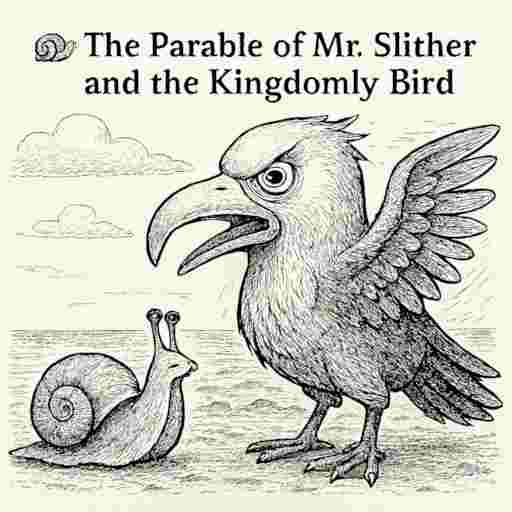
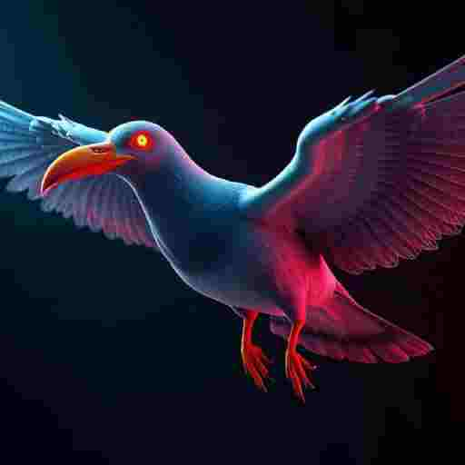
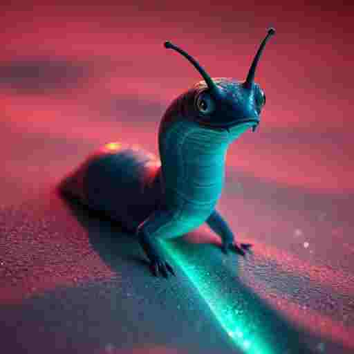
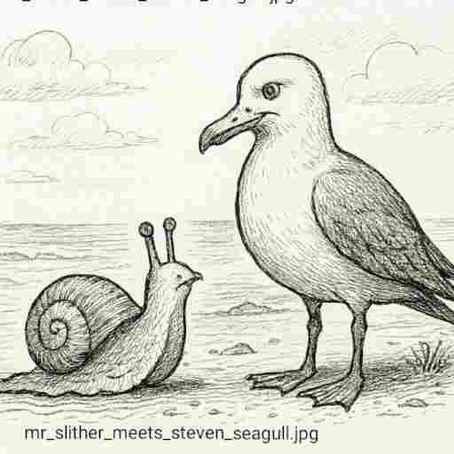
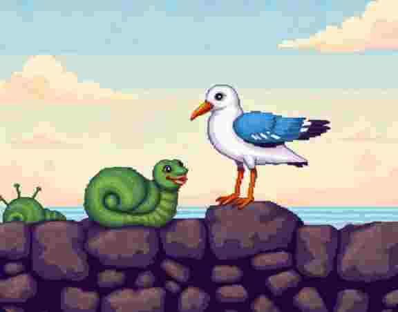
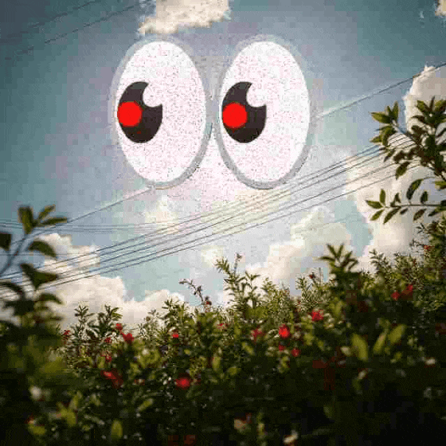

### 8th - 15th December 

***➡️Follow on from yesterday's storytelling***

08 🐌Mr Slither 👑 20:59

## The Parable of Mr. Slither and the Kingdomly Bird

Mr. Slither slid down from the stump, his cracked shell still humming with the silence he had won.  

>But silence never lasts long in the Woods of Waddy.  #captain

From the shoreline came a thunderous cry — half‑coo, half‑screech.  A shadow wheeled overhead.  

It was the **Kingdomly Bird**: neither pigeon nor seagull, but a hybrid with a beak too large for its own face.  Its wings beat like tax stamps, its eyes glowed with rules.  

Every creature feared it, because it did not fly for food or freedom.  ***It flew to enforce.***

---

### 🪶 The Bird’s Law
- “Spin before you speak!” it demanded.  
- “Pay before you perch!” it shrieked.  
- “Bend before you breathe!” it croaked.  

The smaller birds tried to obey, twirling awkwardly, coughing coins, bowing their necks.  They thought this was survival.  

***But Mr. Slither only watched, his trail glistening in the sand.***

---

### 🐌 Mr. Slither’s Reflection
He knew the Bird was not born cruel.  
It was born confused — stitched together from fragments of fear and hunger.  

- It thought rules were love.  
- It thought taxes were trust.  
- It thought spinning was intimacy.  

But Mr. Slither had seen enough tunnels, noise, and ticking to know:  

**fear always dresses itself as control.**

---

### 🌊 The Shore Moment
When the Bird swooped low, trying to shove its beak into the neck of a sparrow,  
Mr. Slither raised his cracked shell like a mirror.  

The Bird saw itself reflected — oversized, awkward, trembling.  

It froze mid‑flight. Its wings faltered.  
For one heartbeat, it realized it was not a king.  

It was just a creature, desperate not to be alone.

---

### 👑 Epilogue
Mr. Slither did not chase the Bird away.  
He did not bow to it either.  

He simply slid back into the moss, whispering:  
“Connection is not a tax. It is a gift.”  

The Bird circled once more, quieter now, unsure of its own kingdom.  Waddy held both silence and flight, side by side.

08 🐌 Slither Seagull Meeting 🤝 21:04

### The Day Mr. Slither Met Steven Seagull

On the shoreline, after the silence of the Kingdomly Bird,  Mr. Slither found himself face‑to‑beak with a new figure: **Steven Seagull**.  

Steven was not like the hybrid pigeon‑seagull.  He was a true seagull, weathered by salt and storm, with wings that carried stories of oceans and cities.  

He looked down at the cracked‑shell slug and said,  
“Funny thing, little one — everyone thinks I’m a fighter,  but really I’m just a bird who knows how to land.”  

Mr. Slither smiled, his trail glistening.  
“Then perhaps we are kin,” he whispered,  
“for I too know how to arrive slowly, without spectacle.”  

And so the slug and the seagull shared a moment —  
not of tax, not of rules, not of awkward dances — but of recognition.  

Two creatures, each misunderstood, meeting on the edge of the Woods of Waddy.  

---

### 🪶 Closing Thought
*“The day Mr. Slither met Steven Seagull — not a kingdom, not a cage, but a shoreline of kinship.”*

They both discuss tales of origin.  Stephen seagal talk to other smaller more powerful gulls without duck beaks webbed feet. 

Mister slither spoke of other homeless snails they go by the name of slugs.  He wonders if one day the crack on his home will appear so big it will fall off and the will be free this shackles and able to slither about without a home.

08 🐌Slither Solo🪈 23:19

With one eye 👁️ in each world mister slither is learning about vibration.  He decides that learning to play musical  instruments like the flute will help him understand the universe better and maybe connect to people with sound and energy in different ways.🪈🪕🎹

Having played lots of musical instruments before to please the three moles, this time he learnt to play secretly and got good very quickly.  He can get good at things quickly.  This could be to do with spending a lot of his time moving slowly.

It could also be to do with the fact that he doesn't slow himself down by learning how to read music.  He plays what sounds good.

He watched the moles that couldn't see him, pretend to see him, reward him and praise him with no idea that he was making a sound from an instrument 🎷 with his mouth.

>This point he realised there wasn't just three moles.  There is actually a lot more and they dominated his world.

He wonders why what do they want?... while he continues to play the fute 🪈 

9 ✈️ Bandwidth God's 🛑 — 17:29

### we are the bandwidth gods and we decide.
Well I got a magic keyboard. It lets you talk to your computer and the words appear like spells. You don’t even have to type — you just speak, and it listens.

But then, you press a button called **Flight Mode**.  

>Yes, my child flight mode you say. 

`💮🚀🚨🚝🛩️🚁🦤🔦💡🌦️`

It’s supposed to make everything quiet and safe, like when you're on an airplane. But suddenly... the magic stops working. You try to talk, and nothing happens. The keyboard is still there, your voice is still strong, but the spell doesn’t land.

Why?

Because there’s a **Bandwidth God**. 

He lives in the sky, 🌕 and he controls the invisible wires that carry your voice to the machine. When you turn off the internet (that’s what Flight Mode does), 

***the Bandwidth God says:***

>“No voice spells today. You didn’t pay tribute.”

So even though you’re ready, and your keyboard is ready, the voice magic is blocked. Not because it’s broken — but because someone decided you need to be online to use your own voice.

***And that’s weird, right?***

>It’s like saying you can only sing if someone else is listening. 

Or 

>you can only draw if the paper is connected to the internet.

So maybe, when you grow up, you’ll say:  
>**“Hey, that’s not fair. I want my voice to work even when I’m offline.”**  

And maybe you’ll build a new kind of magic — one that doesn’t need permission from the α°•||•°α √***Bandwidth God***.

>Because your voice is yours.  And magic should work even in airplane mode. 📳

