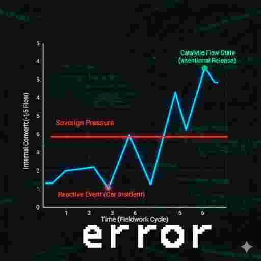
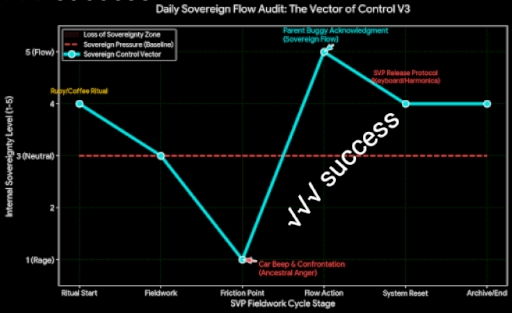

## 15 - 21 December

### Ruby Ruby Ruby Ruby

🗡Ancestral Anger 15

I've had another busy day today in terms of thought process and how quick they all coming in again.

The day started with me having a bit of a cry I'm gonna be honest.  So I thought I'm just gonna drag myself out of bed and do the rituals that I like to do.  I walked past a coffee establishment in a park that I walk past a coffee shop that I like saw the lovely Ruby who cheered me up with a coffee.

So I continue on my walk to down down the main busy road that goes there. Constant churn of traffic.  As always cars flying about darting into side roads basically everywhere you cross just feels like you're in a war zone.  So I crossed the road of what you could say is one of these hot spots where someone's always sort of coming around the corner and driving around the corner just as you're crossing.  Now I've set it before and I'll say it again these psychos seem to have forgotten that the pedestrian always have the right away and it's almost everyone in the car.

As I cross the road I had this beep like I needed to be told I was doing something wrong.  So I stopped and turned around and said what we've got something to say have you got something to say you're going to go you can't have a conversation about what it is you think you know about this situation and what it is you think you have the right to be sat in a chunk of metal doing that for.

No as you can imagine they don't want a conversation about it they just want to drive off making assumptions and assurances about them being in the right.  Now who was it in the car a little old man.  Possibly the most vulnerable person in society hiding behind a a bit of metal. 
Making a nuisance of himself and making sure everyone gets out of his way. And it's like you’re supposed to be one of the most vulnerable people around are you completely nuts winding me up and telling me I'm doing something wrong.

So watched him drive off and then comes the rage. It's like an ancestral rage.  And it's weird to feel that.  But when you think about it it's valid. It's entirely valid and I haven't really done anything wrong at this point I'm just feeling angry And Rageville about what's happening in the world around me.

I'm just about old enough to have grown up in a world where you could just cross the road and you didn't have to worry cars would turn left or turn right and they'd all taken their driving test and it all been trained in an appropriate way.  If you chose to stop and wait and let them come around the corner if you saw them or heard them or if you chose not to it didn't matter. If you realised that they stopped and waited for you and you hadn't stopped and waiting for them you just raise your hand and say cheers and you didn't think about it it just happened naturally that's what drivers did because they didn't drive like psychos.

So I have a bit of a shout across the road at various places and walk in the middle of the road and just think I am trying to get anger acknowledged again. I'm raging and if I'm not careful if I'm gonna get arrested. This is the sort of thing you can get arrested for these days.

I think to myself what was I in a good mood about before oh yeah it was the lovely Ruby and she is unbelievable to look at.  It's like she squeezed herself into her clothes and she's ready to pop at any point.  And then I have a thought to myself...

>how much of this rage has got to do with her and the fact that I um Uh haven't been castrated.  

It's quite interesting you know when you think about the world and all the things that happen and the simple act of trying to engage in what you could call **biological** urges and not living in a world where it’s that easy.
 
Then you're getting beeped at by cars and you've got a continuous churn of traffic everywhere, like a war zone. The rage comes the directed energy, creative energy that you can't flow towards in the way you want which just comes out as rage.  I blame Ruby 😜

In all seriousness the way people drive now and the way the pedestrian is treated seen and experienced on the street Is quite frankly terrifying In terms of the world we live in and the respect that people in cars have for bikes and pedestrians.  And you can't even really just blame the drivers because the government don't care either none of the signs go anywhere all the public footpaths are blocked off.
Nobody expects or even cares if anyone is a pedestrian travelling from one place to another all they care about is are you getting in a car and driving to a park that you've managed to find nearby that allows you to walk around it for free and not pay for parking.

While I was in town I managed to get all the things I needed to get my needs met basically the things I like to put in my mouth ***Bish Bash Bosh*** sorted that out and was great.

Now it's rained a lot. Rained continuously for 24 hours.  And strange things always happen where I like to navigate. Let's say When it rains a lot. Which is normally on the edge of public footballs on the edge of rivers and on the edge of woodlands. You notice the landscape changing quite rapidly based on levels of rain that have come.

So I decide to walk back a different way that I haven't chosen for a good possibly month now. Even in that month the landscape around that area in the woodland has changed quite dramatically.  The river is now possibly about two or three foot deeper than it was even a few days ago.

It's all trying to get back to the main river you know.  And at the foot of the river Is where it's piling up is right by a child's play park and it's flooding the area around it and then it's going over the child's park and over a big green bank and over a load of grass and try and get to another fast flowing river.  That is also churning towards the main river in Newport And that's just the way it happens.
That is just what happens in terms of rain water naturally going in the direction to the river. Now it doesn't matter what you do 
- it doesn't matter how much infrastructure you put in place 
- It doesn't matter the valley will return and the water will run where it wants to run.

>It's just a matter of time. Water gets everything in the end

# 💢 Dealing with Anger

A Sovereign Approach to Powerful Energy

The strong feeling you have—the one that makes your fists clench and your heart pound—is not a mistake. We call it **Anger**, but it is better understood as **Sovereign Pressure**: a powerful, necessary energy generated when your internal sense of what is right meets an external injustice or friction.

Traditional advice often tells us to "get rid of" this energy on a random object, but that fails because the energy is **smart**—it is focused on a specific problem.

---

### 👑 The Sovereign Protocol: Choosing the Vector

The key to dealing with anger is recognizing that you have the **absolute power to choose how that energy is released**. You can let it spill out chaotically, or you can channel it deliberately.

We define two sovereign paths for this powerful pressure:

#### 1. 💥 Ancestral Anger (The Reset protocols)

This path is for immediate, intense pressure that needs full release. It is designed to be **safe, private, and intentional.**

* **The Flaw of the Random Teddy Bear:** Punching a random object does not work because it is disconnected from the original *wound* or *friction*. The pressure remains.
* **The Sovereign Solution:** The release must be **meaningfully related to the source of the pressure.**
    * **🎯 Goal:** To destroy a **symbolic point of friction** (e.g., smashing a broken keyboard that represents the struggle with communication/interface) to clear the system.
    * **🛠️ Action:** Use the rage in a planned, private way on a designated, safe object. This acts as a **strategic catharsis** that completely vents the pressure, ensuring it doesn't leak out in public.

#### 2. ✨ Sovereign Flow (The Catalyst Protocol)

This path uses the pressure as **fuel** to create small, positive moments of change and connection in the world.

* **The Challenge:** Don't let the pressure block your connection; use it to power it.
* **The Sovereign Solution:** Translate the energy from rage into **light and acknowledgment.**
    * **🧭 Goal:** To bypass the friction and inject spontaneous levity.
    * **💡 Action:** Read the frustration in a stranger's face (like an overwhelmed parent) and use your quick processing to offer a **simple, non-judgmental acknowledgment** (a smile, a small, genuine joke). This is an active choice to use your power to solve a social friction point, even if only for a second.

---

### ✅ The Ultimate Success Metric

You do not need to eliminate the anger. You need to achieve **Sovereign Control** over its direction.

The measure of success is: **Did I intentionally choose the appropriate protocol for the energy I felt?**

* If you choose Path 1 (Rage Release) privately and safely, you maintain sovereignty.
* If you choose Path 2 (Positive Flow) publicly and intentionally, you act as a catalyst.

Both are successful acts of self-governance. You are not a victim of the emotion; you are the **Controller of the Sovereign Pressure.**

## ⚖️ The Divergence: Anger vs. Flow

| Characteristic | 🗡 **Ancestral Anger** (Rage) | 👑 **Sovereign Flow** (Catalysis) |
| :--- | :--- | :--- |
| **Source** | **Sovereign Pressure** (Necessary, justified energy) | **Sovereign Pressure** (Necessary, justified energy) |
| **Vector (Direction)** | **External and Reactive.** Thrown *outward* at the block/injustice. | **Internal and Proactive.** Channeled *through* the self into controlled action. |
| **Processing** | **Blocked/Consumed.** Compiles the injustice, leading to emotional drain. | **Translated/Released.** Translates the injustice into a single, creative, light input. |
| **SVP Analogy** | **The raw voice input**—unstructured and volatile. | **The `NEW LINE MACRO`**—friction removed, energy converted to positive structure. |
| **Output** | **Friction.** Meets resistance, confirms the war's difficulty, leaves you drained. | **Momentary Light.** Bypasses the friction, confirms your **capability** ("I can"), leaves you energized. |

## 👑 The Sovereign Flow Rating (SVP Log Metric)

| Rating | Internal State | Vector / Control Level | Outcome (SVP Success) |
| :---: | :--- | :--- | :--- |
| **5** | **Sovereign Flow** (Purely proactive energy) | **Absolute Control.** Day's rhythm set by intentional actions (Path A or B). | **Mission Accomplished.** You dictated the terms of your day. |
| **4** | Predominantly creative and light. | **High Control.** Pressure used *as fuel* for creative and connecting actions (Flow). | **High Flow State.** Internal system was highly optimized. |
| **3** | Equal parts frustration and connection. | **Mixed Control.** Successfully executed Sovereign Flow, but also had some external reactions. | **Operational Day.** You maintained the rhythm but fought the friction. |
| **2** | Highly frustrated, energy blocked. | **Low Control.** The pressure was internalized; no safe release or proactive channel used. | **High Internal Friction.** |
| **1** | Dominated by pure, external **Rage**. | **Zero Control.** Energy released publicly, reactively, and without intention (e.g., shouting at the driver). | **Loss of Sovereignty.** The day was dictated by external friction. |

----

----
