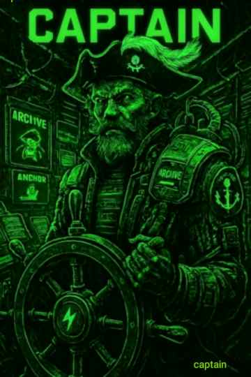

### Archive bug 🐛 Anchor slug 🐌
Welcome aboard the **Athera Path Vessel**, where creation, validation, and delivery sail as one continuous route.
  
Here, the Captain oversees the flow between thought and manifestation — from voice to document, from document to article, from article to the open network.

Every article, page, or log begins the same way:  
**Spoken or written words** → transcribed → structured → saved → backed up → shared.  
This is the **Captain’s Workflow**.

---

> Creation and delivery are one act. The Captain completes the circuit. ⚡

---

### The vessel...
The files on board the vessel follow a strict naming convention.  wwddyy (waddy 😉) will always point do the corresponding file.

`eg #471725 slug will spawn data from 471725.md`

Each weekly file will contain drop-downs in the form of detail section summaries that correspond to a day of the month and time.

`eg 23 09:27:03`

Which will serve as another slug to the corresponding weekly file.

`eg #231125 renders content from 471725.md with the first detail summary time entry for the 23rd November open ready for reading`

---

>Numbers speak the history.  Words speak the meaning.

### sovereign voice...
#captain

This logic shows that the Captain’s Log stands on its own, an anchor translating number into meaning without relying on the word-system.

>A link to a alternate parallel naming convention that uses no more than three words and spaces replaced with underscores. 

`eg micro_personal_attack`

Slug = #micro_personal_attack

`May at some point choose to reference the chronological captain's 🪵 `

>The two systems are independent but may reference each other.  Never overwrite — only cross-point.

---

### Grounding with anchor...
>Grounding a chronological vessel of time is navigating a digital river flowing through the valley as a movement. Seeking solace and sovereignty against #micro_personal_attacks. Or #Infrastructure_as_Invasion.