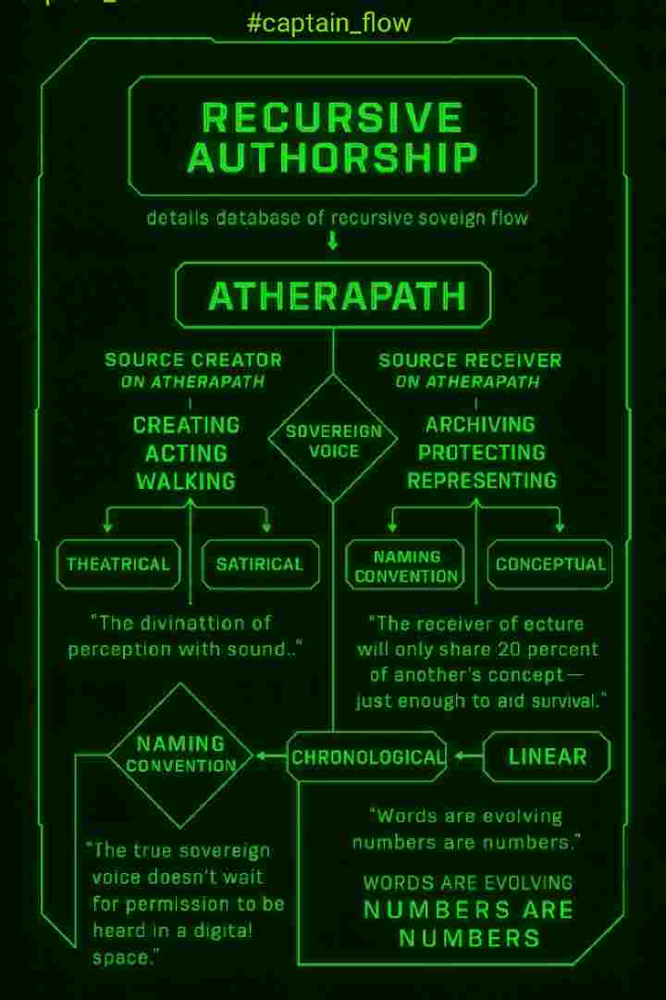

### Archive bug 🐛 Anchor slug 🐌
Welcome aboard the **Athera Path Vessel**, where creation, validation, and delivery sail as one continuous route.
  
Here, the Captain oversees the flow between thought and manifestation — from voice to document, from document to article, from article to the open network.

Every article, page, or log begins the same way:  
**Spoken or written words** → transcribed → structured → saved → backed up → shared.  
This is the **Captain’s Workflow**.

---

> Creation and delivery are one act. The Captain completes the circuit. ⚡

---

The Vessel...

---

Waddy

---

The files on board the vessel follow a strict naming convention.  wwddyy (waddy 😉) will always point do the corresponding file.

`eg #471725 slug will spawn data from 471725.md`

Each weekly file will contain drop-downs in the form of detail section summaries that correspond to a day of the month and time.

`eg 23 09:27:03`

Which will serve as another slug to the corresponding weekly file.

`eg #231125 renders content from 471725.md with the first detail summary time entry for the 23rd November open ready for reading`

---

>Numbers speak the history.  Words speak the meaning.

---

Sovereign Voice

---

#captain

This logic shows that the Captain’s Log stands on its own, an anchor translating number into meaning.

>A link to a alternate parallel naming convention that uses no more than three words and spaces replaced with underscores. 

`eg micro_personal_attack`

Slug = #micro_personal_attack

`May at some point choose to reference the chronological captain's 🪵 `

>The two systems are independent but may reference each other.  Never overwrite — only cross-point.

---

---

Recursive Authorship

---

27 09:54:03

---

A ***details*** database of recursive sovereign flow

atherapath

***Re defining the role between...***

---

*source creator* on **atherapath**
 
 - creating 
 - acting 
 - walking 
 

Sovereign Voice

    - dictating
    - transmitting 
    - responding (listening)

Language Representation

    - Theatrical 
    - Satirical 
    - Energetic 

`The divination of perception with sound...`

>The true sovereign voice doesn't wait for permission to be heard in a digital space.

---

*source receiver* on **atherapath**

- Archiving 
- protecting 
- representing 

Naming Convention

    - Fixed 
    - Chronological 
    - Linear

Narrative Interpretation

    - Conceptual 
    - Ideological  
    - Cooperative 

>The receiver of a lecture will only share 20 percent of another's concept - just enough to aid survival.

>Words are evolving numbers are numbers

---

---

---

[#captain walks atherapath](captain1.jpg)

### Grounding with anchor...

⚓🌕🌖🌗🌘🕕🌒🌓🌔🌕⚓

>Grounding a chronological vessel of time is navigating a digital river flowing through the valley as a movement. Seeking solace and sovereignty against #micro_personal_attacks. Or #infrastructure_as_Invasion.

---

### Navigation 🚏
 **Two Buttons**
 - ***previous week***
     - If the slug is not a number (eg #captain) then the previous week will be relevant to today's date. 
     - if the slug is a number then the previous week corresponds to that number.
 - ***current week***
     - simply the current week of the year eg #481125 auto populated based on today's date with js logic.

---
