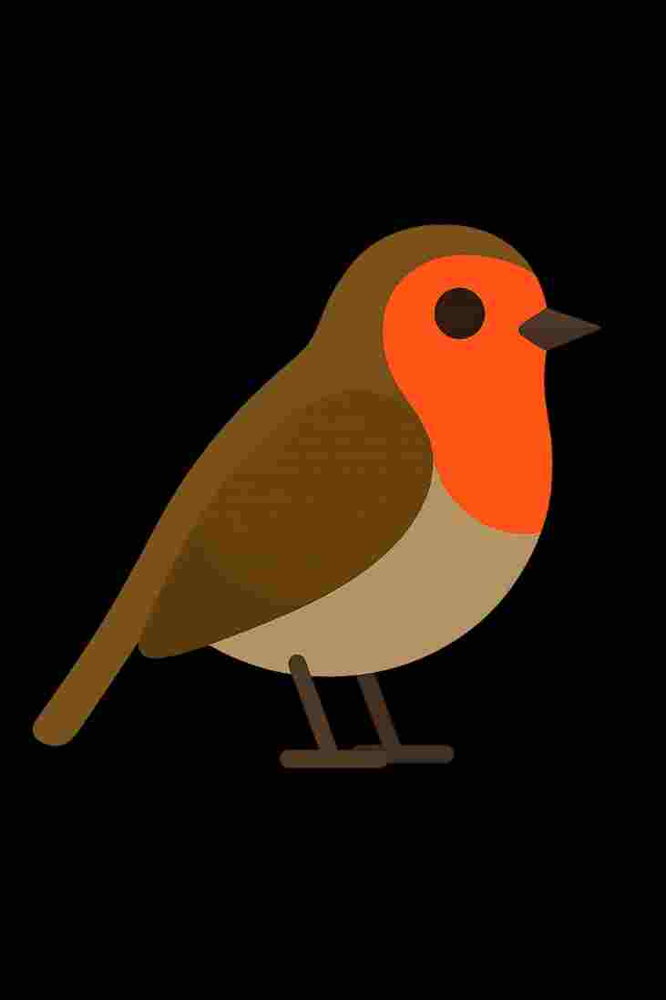

## Robin Emoji Experiment 🔬 (The Archive Entry)

### 🐦 The Absent King: Why We Need A Robin Emoji 

Imagine you are seven years old, and you see the world perfectly—you see the patterns, you see the Robin. Now, try to send a simple picture of the Robin to a friend. 

You can't. 
>Why? 
Because the digital Archive—the one that holds all the universal symbols—is missing the king of the garden. 

This isn't just a mistake; it points to a much bigger game of control and commerce.

---

### 💸 The Commercial Glitch (The Blue Bird Ghost)

The absence of the Robin reveals the strange rules of the digital world:

* **The Contamination:** The only bird that even slightly resembles a Robin is blue and looks exactly like the old, dying logo of a major social media platform.

* **The Hidden Tax:** This suggests that the space for a natural, common symbol is being blocked or contaminated by the **ghost of commercial power**—a symbolic **tax** that demands payment before the *real* thing can be granted a place.

* **The Codswallop of Forms:** We are told that...
> "no one has asked" for a Robin. 
* This is nonsense. Based on human behavior and the need for symbolism, we *would* have asked, and shouldn't even *need* to. A common symbol should have been **just done**. 

The forms and bureaucracy are the new **Bird’s Law**—rules designed for **control, not connection**.

---

### 🧪 The Scientific Experiment: Proof of Presence

The experiment is simple: **We will force the issue.**

1.  **The Hypothesis (H1):** The current system, driven by policy and commercial viability, will **ignore** the request for a non-commercial, essential symbol. This will prove the system is fundamentally flawed and resistant to non-taxed reality.

2.  **The Proposal:** We submit the Robin for official accreditation, using **real life** as the primary source of data. The image is sized to the exact digital requirements (18x18px, 72x72px, and 24x24px for demonstration) to satirize the demand for legibility over truth.

3.  **The Proof (Visual):** The submitted image is a document of **digital failure**—a photo taken by the phone that turns the Robin into a "rumour", proving that the camera cannot capture the creature that exists perfectly in the **"thin strip between shadow and sunlight"**.

4.  **The Alternative (H2):** If the emoji is approved, it proves that the system is merely **strange** and susceptible to being pushed, potentially showing that commercial pressure (H1) can be overcome by sheer human will and documentation.

---

### 👑 The Final Lesson

Whether the Robin is accepted or ignored, the lesson is the same:

**Connection is not a tax. It is a gift**. The real Robin—the **Threshold Trickster** and **Master of Territory**—will continue to visit, unbound by pixels, algorithms, or the rules of the **Bandwidth God**.
